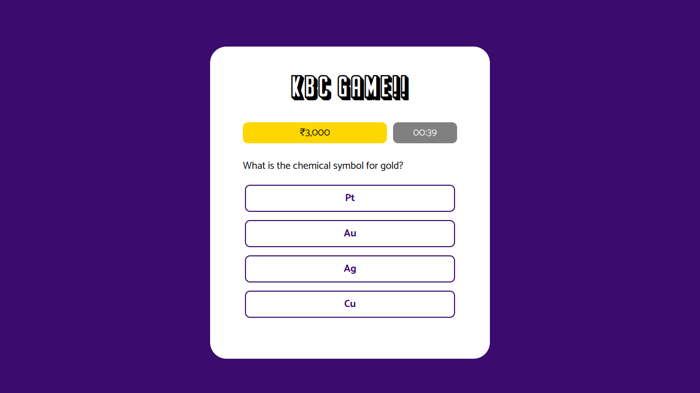

## KBC Quizzes Game
KBC Quizzes Game is a mini quizzes app that is originally adapted from an Indian game show named the same name, [Kaun Banega Crorepati (KBC)](https://en.wikipedia.org/wiki/Kaun_Banega_Crorepati).

## Project Screenshot(s)

## Installation and Setup Instructions
Clone down this repository and run in your browser or you could see this project had been deployed into vercel in [kbc-quizzes-game.vercel.app](https://kbc-quizzes-game.vercel.app).

## Reflection
This self-project was made because of a request from my Indian friend, [Akkiraj1234](https://github.com/Akkiraj1234). We planned to show our skills in web development by making a simple quizz game. He asked me to make it within 1-2 weeks.

One of the main challenges during this project development was Correct-Wrong and Option Randomizing Logic. I had to struggle with it for about 5-6 days to understand and implement the Logics.

The technologies implemented in this web project are HTML, CSS and JavaScript. I chose to use VanillaJS because the logics were not that hard as I think. In the future projects, I will try to learn more about JavaScript to increase the interactivity of a website.
